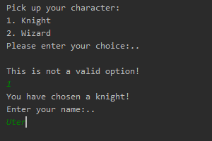
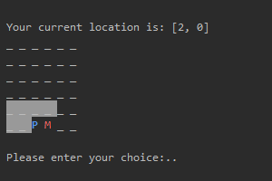

## Command line based role playing game.

### About
This is a command line based role playing game.
The game has following features:
- A player can create a character :heavy_check_mark:
- A player can explore the world :heavy_check_mark:
- A player can gain experience through fighting :heavy_check_mark:
- A player can save and resume a game :heavy_check_mark:

See examples below.

### Constraints
- Only plain Java except for tools for testing and building CI/CD pipelines
- CLI interface

### Features
- This project is MVP (Minimum Viable Product). Therefore it is not rich with features and not perfect in details
- Project is supplied with instructions (this readme) 
- Project is build with respect to agile engineering practices, see next chapter

### Engineering practices involved
- :white_check_mark: Project is under VCS control (GIT)
- :white_check_mark: Project is hosted on GitHub
- :white_check_mark: CI pipeline (Travis CI) is configured to build on each push
- :white_check_mark: Project is covered with unit tests (partly though)
- :white_check_mark: Code coverage plugin is included to the CI pipeline
- :white_check_mark: Code static analysis plugin is included to the CI pipeline
- :white_check_mark: Build, coverage and analysis badges from 3d party services are added to this repo (see at the top)
- :black_square_button: Dockerize: automate building a docker container and deploy it to any registry
- :black_square_button: Deploy: automate deployment\

Since this is not a web app, the last two options are rather useless, but they still might be a good exercise. 

### Requirements
- Java 1.8
- Docker(optional)

### How-to run
`$ git clone https://github.com/chirkov86/codingpuzzle.git`\
`$ cd codingpuzzle`\
`$ ./gradlew build`\
`$ java -jar ./build/libs/codingpuzzle-1.0-SNAPSHOT.jar`

### Possible extensions
Code has several extension points and supposed to make the project extensible

### Game process examples 
1. Creation:\
\
2. Exploration:\
\
3. Fighting and gaining exp:\
\

### Backlog
- Add map legend, e.g. P - player, M - monster, G - treasure
- Add a hero dashboard, e.g.\
Name | Player1
--------- | ----------
Name | Player1
Class | Wizard
HP | 80/100
Damage | 15-25
- Add in-game game topic switcher

