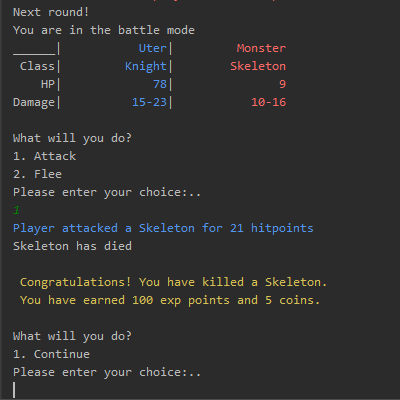

## About
This is a command line based role playing game.
The game has following features:
- a player can create a character :heavy_check_mark:
- a player can explore the world :heavy_check_mark:
- a player can gain experience through fighting :heavy_check_mark:
- a player can save and resume a game :heavy_check_mark:

See examples below.

### Game process examples 
1. Creation:\
\
2. Exploration:\
\
3. Fighting and gaining exp:\
\